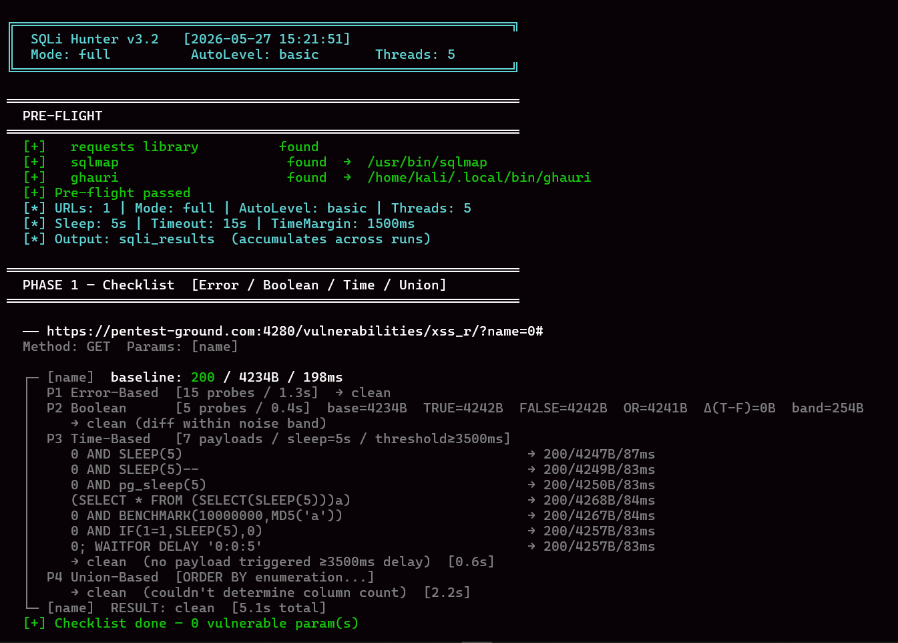

# SQLi Hunter

A checklist-based SQL injection scanner built around the methodology of manual testing. It runs every parameter through four ordered detection phases before passing confirmed findings to automated tools for exploitation.

---

## How it works

The scanner runs in two independent phases.

**Phase 1 — Checklist Engine** (native Python, no external tools required)

For every URL, it extracts all query parameters or POST fields and tests each one independently. The four phases run in order and stop as soon as a vulnerability is confirmed:

1. Error-Based — injects quote variations and looks for SQL error signatures in the response body
2. Boolean-Based — compares TRUE condition vs FALSE condition response sizes, cross-validated to filter dynamic page noise
3. Time-Based — sends sleep payloads and confirms with proportional timing (sleep 3 / sleep 7) to rule out network jitter
4. Union-Based — enumerates column count via ORDER BY then attempts UNION SELECT injection

Every phase prints what it sent, what came back, and why it decided. Nothing is silent.

**Phase 2 — Auto Engine** (sqlmap / ghauri)

Runs after Phase 1. In `full` mode it always executes regardless of Phase 1 results. If Phase 1 confirmed a vulnerability on a specific parameter, Phase 2 targets that parameter directly and passes the confirmed technique as a hint so the tool focuses its effort. Basic and advanced levels run sequentially on the same tool to avoid session conflicts.


---

## Installation

```bash
# Clone the repo
git clone https://github.com/Mostafa-Maklad/Sqli_Hunter.git
cd Sqli_Hunter

# Install Python dependency
pip install requests

# Install sqlmap and ghauri (optional, needed for Phase 2)
bash install_sqli_tools.sh
source ~/.bashrc
```

The install script clones sqlmap from the official repo and installs ghauri via pip. It also cleans up any conflicting aliases from shell config files.

---

## Usage

```
python3 sqli_hunter.py [options]
```

### Input

| Option | Description |
|---|---|
| `-U URL` | Single target URL |
| `-u FILE` | File of target URLs, one per line |
| `--method GET\|POST` | HTTP method (default: GET) |
| `--data STR` | POST body: `username=admin&password=test` |
| `--param LIST` | Comma-separated params to test: `id,search` |
| `--skip-param LIST` | Params to skip |

### HTTP

| Option | Description |
|---|---|
| `-H "Key: Val"` | Custom header, repeatable |
| `-c "k=v; k2=v2"` | Cookie string |
| `-x http://127.0.0.1:8080` | Proxy (Burp Suite) |
| `--user-agent UA` | Custom User-Agent |
| `--timeout SEC` | Per-request timeout (default: 15) |
| `--delay SEC` | Delay between requests |
| `--no-redirects` | Do not follow HTTP redirects |
| `--verify-ssl` | Enable SSL certificate verification |

### Detection

| Option | Description |
|---|---|
| `--sleep SEC` | Sleep duration for time-based tests (default: 5) |
| `--time-margin MS` | Timing tolerance in ms (default: 1500) |
| `--test-headers` | Also test User-Agent, Referer, X-Forwarded-For |
| `--test-cookies` | Also test cookie values |

### Mode

| Option | Description |
|---|---|
| `--mode checklist` | Phase 1 only, no sqlmap/ghauri |
| `--mode auto` | Phase 2 only on all URLs |
| `--mode full` | Both phases (default) — Phase 2 always runs |
| `--auto-level basic\|advanced\|both` | sqlmap/ghauri scan profile (default: basic) |
| `--auto-on-all` | Force Phase 2 on all URLs even with confirmed findings |

### Concurrency

| Option | Description |
|---|---|
| `--threads N` | Checklist worker threads (default: 5) |
| `--auto-threads N` | Auto tool worker threads (default: 3) |
| `--auto-timeout SEC` | Per-URL timeout for sqlmap/ghauri (default: 300) |

### Output

| Option | Description |
|---|---|
| `-o DIR` | Output directory (default: `sqli_results`) |
| `-v` | Verbose — show all phases per parameter |
| `--no-color` | Disable colored output |

---

## Examples

**Basic scan — GET URL with query params**
```bash
python3 sqli_hunter.py -U "https://target.com/page?id=1&cat=2"
```

**POST login form**
```bash
python3 sqli_hunter.py \
  -U "https://target.com/login" \
  --method POST \
  --data "username=admin&password=test" \
  --mode full \
  --auto-level advanced
```

**POST form where you only know the field names but not the values**
```bash
python3 sqli_hunter.py \
  -U "https://target.com/login" \
  --method POST \
  --param username,password \
  --mode full
```

**Checklist only, verbose, through Burp**
```bash
python3 sqli_hunter.py \
  -U "https://target.com/search?q=test" \
  --mode checklist \
  -x http://127.0.0.1:8080 \
  -v
```

**Scan a list of URLs, both sqlmap levels, more threads**
```bash
python3 sqli_hunter.py \
  -u urls.txt \
  --mode full \
  --auto-level both \
  --threads 10 \
  --auto-threads 5
```

**Slow target — increase sleep and timeout**
```bash
python3 sqli_hunter.py \
  -U "https://target.com/page?id=1" \
  --sleep 10 \
  --timeout 25 \
  --time-margin 2500
```

**With custom headers and cookie**
```bash
python3 sqli_hunter.py \
  -U "https://target.com/api?id=1" \
  -H "Authorization: Bearer YOUR_TOKEN" \
  -c "session=abc123" \
  --mode full
```

---

## Output

All results are written to `sqli_results/` (or the directory specified with `-o`). The folder accumulates results across runs — old findings are never deleted.

```
sqli_results/
├── evidence.json              # Accumulated findings from all runs
├── report_TIMESTAMP.json      # Current run only — clean, no historical bleed
└── raw_logs/
    ├── sqlmap/
    │   ├── basic/             # sqlmap basic session files
    │   └── advanced/          # sqlmap advanced session files (separate)
    └── ghauri/
        ├── basic/
        └── advanced/
```

**report_TIMESTAMP.json** contains only the current run. It is structured as:

```json
{
  "scan_metadata": { ... },
  "summary": {
    "checklist_vuln_params": 2,
    "sqlmap_findings": 1,
    "by_technique": { "time-based": 1, "error-based": 1 }
  },
  "evidence": {
    "checklist": {
      "findings": [
        {
          "url": "https://target.com/page?id=1",
          "param": "id",
          "technique": "time-based",
          "payload": "1' AND SLEEP(5)--",
          "confidence": "high",
          "confirmed": true,
          "evidence": {
            "baseline_ms": 120,
            "candidate_ms": 5210,
            "confirmations": [
              { "sleep_sec": 4, "expected_ms": 4000, "actual_ms": 4189, "pass": true },
              { "sleep_sec": 7, "expected_ms": 7000, "actual_ms": 7043, "pass": true }
            ]
          }
        }
      ]
    },
    "sqlmap": { "findings": [ ... ] },
    "ghauri":  { "findings": [ ... ] }
  }
}
```

---

## Phase 1 output explained

For every parameter tested, the scanner prints a structured trace:

```
  ┌─ [id]  baseline: 200 / 4218B / 87ms
  │  P1 Error-Based  [15 probes / 0.4s]  → clean
  │  P2 Boolean      [5 probes]  base=4218B  TRUE=4218B  FALSE=4218B  Δ=0B  band=253B
  │     → clean (diff within noise band)
  │  P3 Time-Based   [9 payloads / sleep=5s / threshold≥3500ms]
  │     1' AND SLEEP(5)--                  → 200/4218B/5312ms  ← candidate
  │     Confirming with proportional sleeps...
  │     sleep(4s) → expected=4000ms  got=4218ms  PASS
  │     sleep(7s) → expected=7000ms  got=7089ms  PASS
  │     → CONFIRMED  confirmations=2/2  confidence=high
  └─ [id]  RESULT: VULNERABLE  [12.4s total]
```

If the baseline comes back 4xx, the scanner warns that the endpoint is blocking requests and that results may be unreliable, but continues testing.

---

## Requirements

- Python 3.10+
- `requests` library (`pip install requests`)
- sqlmap (optional, for Phase 2)
- ghauri (optional, for Phase 2)

---

## Notes

- The scanner is designed for authorized testing only.
- For POST forms with CSRF tokens, pass the full request body via `--data` including the token value. sqlmap handles CSRF rotation automatically.
- When using `--auto-level both`, basic runs before advanced on each tool to prevent session conflicts.
- The `--mode full` always runs Phase 2. To run only the checklist, use `--mode checklist`.
